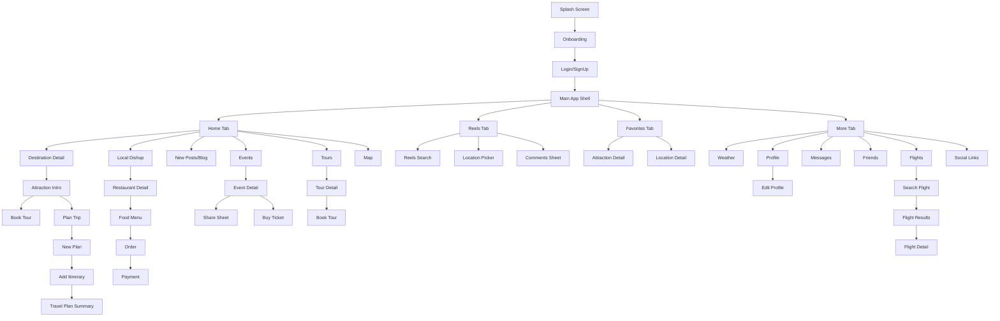

# Travelike - Flutter UI Implementation Plan

## Tổng Quan Dự Án

Travelike là một ứng dụng du lịch toàn năng dành cho khách du lịch đến Việt Nam. Dựa trên 78 file design Figma đã xuất, tôi sẽ xây dựng một dự án Flutter hoàn chỉnh với 100% UI mock data, smooth navigation, và kết nối liền mạch giữa tất cả các màn hình.

### Design System đã phân tích từ Figma:
- **Primary Color**: `#8B4049` (Marsala/Wine Red) - Button chính, accent
- **Secondary Color**: `#C4776E` (Rosy Brown) - Button phụ, gradient  
- **Background**: Gradient pastel (cream → pink → light blue) - Đặc trưng nền apps
- **Text Primary**: `#1A1A2E` (Near Black)
- **Text Secondary**: `#6B7280` (Gray)
- **Accent Red**: `#CC2222` (cho tiêu đề, highlight)
- **Card Background**: White/Semi-transparent với border-radius lớn
- **Font**: Serif (tiêu đề) + Sans-serif (nội dung) - Google Fonts: Playfair Display + Inter

---

## User Review Required

> [!IMPORTANT]
> **Quy mô dự án rất lớn (~50+ màn hình).** Tôi sẽ chia thành các Phase để đảm bảo chất lượng. Phase 1 sẽ bao gồm toàn bộ core screens và navigation framework. Phase 2 sẽ polish animations và các màn phụ.

> [!WARNING]  
> **Về hình ảnh:** Tôi sẽ sử dụng network images từ Unsplash/Pexels cho mock data thay vì copy hình từ Figma để giữ cho project nhẹ và professional. Các hình placeholder sẽ là landscape/food/travel photos chất lượng cao.

---

## Kiến Trúc Ứng Dụng

```
lib/
├── main.dart
├── app.dart
├── core/
│   ├── theme/
│   │   ├── app_theme.dart          # ThemeData, colors, typography
│   │   ├── app_colors.dart         # Color constants
│   │   └── app_text_styles.dart    # Text styles
│   ├── constants/
│   │   └── app_constants.dart      # Mock data, image URLs
│   ├── widgets/
│   │   ├── gradient_background.dart    # Gradient pastel background
│   │   ├── custom_bottom_nav.dart      # Bottom navigation bar
│   │   ├── primary_button.dart         # Marsala button
│   │   ├── search_bar_widget.dart      # Search bar component
│   │   ├── location_card.dart          # Location image card
│   │   └── category_chip.dart          # Filter chips
│   └── routes/
│       └── app_routes.dart         # Named routes + transitions
├── features/
│   ├── splash/
│   │   └── splash_screen.dart      # Welcome to Vietnam screen
│   ├── onboarding/
│   │   └── onboarding_screen.dart  # Explore the world your way
│   ├── auth/
│   │   ├── login_screen.dart       # Login with background image
│   │   ├── signin_screen.dart      # Sign in with email
│   │   └── signup_screen.dart      # Sign up free
│   ├── home/
│   │   ├── home_screen.dart        # Dashboard - Main home
│   │   ├── widgets/
│   │   │   ├── home_header.dart        # Hi, ChauNgan + avatar
│   │   │   ├── location_carousel.dart  # Your Location swiper
│   │   │   ├── quick_access_grid.dart  # Local Dishup, New Posts, Events, Tours
│   │   │   └── home_search_bar.dart
│   │   └── explore_screen.dart     # Saved/Favorites with categories
│   ├── reels/
│   │   ├── reels_screen.dart       # TikTok-style reels viewer
│   │   ├── reels_search_screen.dart    # Search reels grid
│   │   ├── reels_location_picker.dart  # Select location overlay
│   │   └── widgets/
│   │       ├── reel_item.dart
│   │       ├── reel_actions.dart       # Heart, comment, share, count
│   │       └── comments_sheet.dart     # Comments bottom sheet
│   ├── events/
│   │   ├── events_screen.dart          # Event Details (Upcoming/Past)
│   │   ├── event_detail_screen.dart    # Event detail with banner
│   │   ├── event_map_screen.dart       # Events on map
│   │   ├── add_event_screen.dart       # Adding Events form
│   │   ├── event_filter_sheet.dart     # Filter bottom sheet
│   │   └── widgets/
│   │       ├── event_card.dart
│   │       └── share_sheet.dart        # Share with friends
│   ├── attractions/
│   │   ├── attraction_list_screen.dart     # Ha Long Bay, Gold Bridge list
│   │   ├── attraction_detail_screen.dart   # Nordic Cottage detail
│   │   ├── attraction_intro_screen.dart    # About + pricing
│   │   └── widgets/
│   │       └── attraction_image_carousel.dart
│   ├── flights/
│   │   ├── book_flight_screen.dart       # Book Your Flight form
│   │   ├── flight_results_screen.dart    # Flight Tickets results
│   │   ├── flight_detail_screen.dart     # VietJet detail
│   │   ├── flight_date_picker.dart       # Select a date
│   │   ├── flight_search_screen.dart     # Search airport
│   │   └── widgets/
│   │       ├── flight_card.dart
│   │       └── flight_route_visual.dart
│   ├── food/
│   │   ├── local_dishup_screen.dart      # Local Dishup grid
│   │   ├── restaurant_detail_screen.dart # Cao Lầu Bá Lễ detail
│   │   ├── food_menu_screen.dart         # Food today (Cake, Noodles...)
│   │   ├── food_order_screen.dart        # Orders #34562
│   │   └── widgets/
│   │       ├── food_card.dart
│   │       └── order_item.dart
│   ├── plan/
│   │   ├── new_plan_screen.dart          # New Plan + calendar
│   │   ├── itinerary_screen.dart         # Add itinerary (Day 1,2,3)
│   │   ├── itinerary_form_screen.dart    # Itinerary Form timeline
│   │   ├── travel_plan_screen.dart       # Travel plan summary
│   │   └── widgets/
│   │       ├── day_tab.dart
│   │       ├── activity_item.dart
│   │       └── timeline_widget.dart
│   ├── weather/
│   │   └── weather_screen.dart           # Weather DaNang
│   ├── map/
│   │   └── map_screen.dart               # Map page with location targeting
│   ├── blog/
│   │   ├── blog_list_screen.dart         # New Blog feed
│   │   ├── blog_detail_screen.dart       # Chou Ngang Post  
│   │   ├── create_blog_screen.dart       # Write your blog
│   │   └── widgets/
│   │       └── blog_card.dart
│   ├── social/
│   │   ├── social_links_screen.dart      # Your social links
│   │   ├── friends_screen.dart           # Your partner list
│   │   └── message_screen.dart           # Message list
│   ├── profile/
│   │   ├── profile_screen.dart           # Profile (own) + About/Event/Reviews tabs
│   │   ├── other_profile_screen.dart     # Other user profile
│   │   ├── edit_profile_screen.dart      # Personal center / settings
│   │   └── widgets/
│   │       ├── profile_header.dart       # Avatar, name, follow stats
│   │       └── interest_chips.dart
│   ├── payment/
│   │   └── payment_screen.dart           # Credit Card Details (dark theme)
│   └── shared_trip/
│       └── shared_trip_screen.dart        # Trip with schedule timeline
└── data/
    └── mock_data.dart                     # All mock data centralized
```

---

## Proposed Changes - Chi tiết Implementation

### Phase 1: Foundation & Core (Priority 1)

---

#### [NEW] Flutter Project Setup
- Tạo Flutter project mới tại `/Users/thanhhuy_23/Workspace/mobile/Travelike/travelike/`
- Dependencies: `google_fonts`, `flutter_svg`, `smooth_page_indicator`, `cached_network_image`, `flutter_staggered_grid_view`, `iconsax_flutter`

---

#### [NEW] Core - Theme & Design System (`lib/core/`)
- **app_colors.dart**: Toàn bộ color palette từ Figma
- **app_theme.dart**: ThemeData với Playfair Display + Inter
- **gradient_background.dart**: Background gradient pastel đặc trưng (cream-pink-lightblue)
- **custom_bottom_nav.dart**: Bottom nav bar 4 tabs (Home 🏠, Reels 📹, Favorites ❤️, Weather/More ☀️)
- **primary_button.dart**: Marsala rounded button với arrow icon

---

#### [NEW] Auth Flow (`lib/features/auth/`)
| Screen | Design Reference |
|--------|-----------------|
| Splash "Welcome to Vietnam" | `iPhone 16 Pro Max - 5.png` |
| Onboarding "Explore the world" | `iPhone 16 Pro Max - 19.png` |
| Login (background image) | `iPhone 16 Pro Max - 20.png` |
| Sign In (email form) | `Login registration page.png` |
| Sign Up (registration form) | `Login registration page-1.png` |

---

#### [NEW] Home / Dashboard (`lib/features/home/`)
| Screen | Design Reference |
|--------|-----------------|
| Dashboard main | `Dashboard.png` |
| Explore/Favorites | `iPhone 16 Pro Max - 6.png` |
| Destination detail (Ha Long) | `iPhone 16 Pro Max - 7.png`, `iPhone 16 Pro Max - 9.png` |

**Key UI elements:**
- Greeting header "Hi, ChauNgan" + avatar
- Search bar with mic icon
- "Your Location" carousel (DaNang, Hoi An, etc.)
- Quick access grid: Local Dishup, New Posts, Events, Tours Book
- Category filter chips (All, Food, Beach, Mountain)
- Destination cards with parallax images

---

#### [NEW] Reels (`lib/features/reels/`)
| Screen | Design Reference |
|--------|-----------------|
| Reels viewer (full screen) | `Reels.png` |
| Reels search grid | `Reels - Search.png` |  
| Location picker overlay | `Reels - Select Location.png` |
| Loading state | `Reels - Loading.png` |
| Comments bottom sheet | `Reels - Comments.png` |

**Key UI elements:**
- Full-screen PageView (vertical scroll like TikTok)
- Location selector dropdown ("Quảng Ninh")
- Heart/Comment/Share/Bookmark buttons with counts
- User info overlay (avatar, name, follow)
- Search with tabs: For you, Top, Người Dùng, Địa điểm, Hashtag

---

#### [NEW] Events (`lib/features/events/`)
| Screen | Design Reference |
|--------|-----------------|
| Empty state | `Events.png` |
| Past events list | `Events-1.png` |
| Filter bottom sheet | `Events-2.png` |
| Event detail | `Events-3.png` |
| Share sheet | `Events-4.png` |
| Events on map | `Events-5.png` |
| Profile events tab | `Events-6.png`, `Events-7.png`, `Events-8.png` |
| Add event | `Profile - Add events.png` |

---

#### [NEW] Attractions (`lib/features/attractions/`)
| Screen | Design Reference |
|--------|-----------------|
| Detail with carousel | `Attraction details page.png` |
| Introduction + pricing | `Attraction introduction page.png` |

---

#### [NEW] Flights (`lib/features/flights/`)
| Screen | Design Reference |
|--------|-----------------|
| Book flight form | `Book flight.png` |
| Flight results list | `Flight tickets.png` |
| Flight detail (VietJet) | `Flights Search result.png`, `Flights Search result-1.png` |
| Date picker | `iPhone 16 Pro Max - 26.png` |
| Airport search | `iPhone 16 Pro Max - 27.png` |

---

#### [NEW] Food (`lib/features/food/`)
| Screen | Design Reference |
|--------|-----------------|
| Local Dishup grid | `iPhone 16 Pro Max - 4.png` |
| Restaurant detail | `iPhone 16 Pro Max - 17.png` |
| Food menu grid | `iPhone 16 Pro Max - 18.png` |
| Order summary | `iPhone 16 Pro Max - 13.png` |

---

#### [NEW] Plan & Itinerary (`lib/features/plan/`)
| Screen | Design Reference |
|--------|-----------------|
| New plan + calendar | `Schedule page.png` |
| Add itinerary | `Travel Arrangement Page.png` |
| Itinerary form/timeline | `iPhone 16 Pro Max - 23.png` |
| Travel plan summary | `Transportation Arrangement Page.png` |

---

#### [NEW] Weather (`lib/features/weather/`)
| Screen | Design Reference |
|--------|-----------------|
| Weather dashboard | `Weather.png` |

---

#### [NEW] Map (`lib/features/map/`)
| Screen | Design Reference |
|--------|-----------------|
| Map with locations | `Map page.png` |
| Location permission | `Modal Frame.png` |

---

#### [NEW] Blog (`lib/features/blog/`)
| Screen | Design Reference |
|--------|-----------------|
| Blog feed | `Blog.png` |
| Blog detail | `Blog-1.png` |
| Create blog | `Blog-2.png` |

---

#### [NEW] Social (`lib/features/social/`)
| Screen | Design Reference |
|--------|-----------------|
| Social links | `Social sharing page.png` |
| Friends/Partners | `Friends communication page.png` |
| Messages list | `iPhone 16 Pro Max - 31.png` |

---

#### [NEW] Profile (`lib/features/profile/`)
| Screen | Design Reference |
|--------|-----------------|
| My Profile (About/Event/Reviews) | `Profile.png`, `Events-6.png`, `Events-7.png`, `Events-8.png` |
| Edit profile/settings | `Personal center.png` |

---

#### [NEW] Payment (`lib/features/payment/`)
| Screen | Design Reference |
|--------|-----------------|
| Credit card (dark mode) | `iPhone 16 Pro Max - 15.png` |

---

#### [NEW] Shared Trip (`lib/features/shared_trip/`)
| Screen | Design Reference |
|--------|-----------------|
| Trip with schedule | `iPhone 16 Pro Max - 22.png` |

---

### Phase 2: Polish & Animations

- Hero animations giữa list → detail
- Custom page transitions (slide, fade)
- Shimmer loading effects
- Pull-to-refresh animations
- Bottom sheet smooth transitions
- Parallax scroll effects trên image headers
- Micro-animations cho buttons, cards

---

## Navigation Flow



---

## Verification Plan

### Automated Tests
```bash
flutter analyze    # No errors/warnings
flutter build apk  # Build thành công
flutter run         # Run trên emulator/device
```

### Manual Verification
- Kiểm tra navigation flow giữa tất cả màn hình
- Verify gradient background consistency
- Test responsive trên nhiều screen sizes
- So sánh pixel-level với Figma designs
- Test smooth scroll, animations, transitions

---
